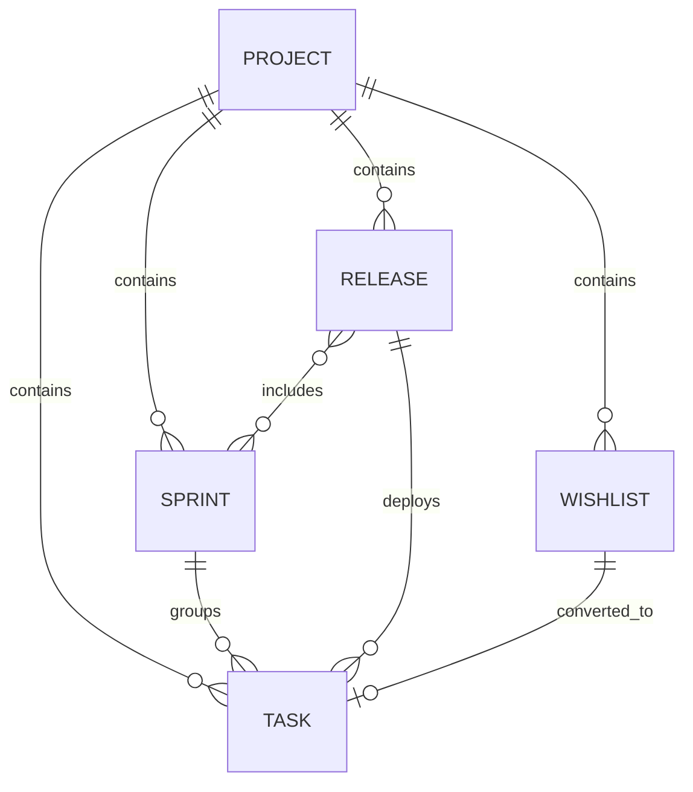

# WorkSphere API: Wishlist, Sprint, Release & Task Integration

Complete architectural specification, schema models, authorization policies, endpoint references, query parameters, request/response examples, and error states for the **Wishlist**, **Sprint**, and **Release** modules.

---

## 1. Architectural Overview & Tenant/Project Isolation

Every entity in these modules is strictly scoped to `companyId` and `projectId`.



### Key Security & Integrity Guarantees
1. **Multi-Tenant Isolation**: Every query checks `companyId` extracted from JWT session.
2. **Project Isolation & IDOR Protection**: `ProjectService.canAccessProject` enforces access checks on every request.
3. **ACID Transaction for Wishlist -> Task**: Conversion generates an incremental task number atomically, creates the task document, marks the wishlist as `CONVERTED`, and logs audit logs within a single MongoDB transaction.
4. **Single Active Sprint Constraint**: Prevents starting more than one `ACTIVE` sprint per project.
5. **Release Version Uniqueness**: Unique compound index `{ projectId: 1, version: 1 }` prevents version duplication within a project.
6. **Optimized Aggregations**: Progress metrics, task completion rates, and dashboards use single-query aggregation pipelines, avoiding $O(N)$ query loops.

---

## 2. API Endpoints Reference

### 2.1 Wishlist Endpoints

| Method | Endpoint | Description | Auth Required |
| :--- | :--- | :--- | :--- |
| `POST` | `/api/projects/:projectId/wishlist` | Create a new wishlist item | Yes |
| `GET` | `/api/projects/:projectId/wishlist` | List paginated wishlist items | Yes |
| `GET` | `/api/projects/:projectId/wishlist/summary` | Get aggregated wishlist counts | Yes |
| `GET` | `/api/projects/:projectId/wishlist/:wishlistId` | Get single wishlist item | Yes |
| `PATCH` | `/api/projects/:projectId/wishlist/:wishlistId` | Update wishlist item | Yes |
| `DELETE` | `/api/projects/:projectId/wishlist/:wishlistId` | Delete wishlist item | Yes |
| `POST` | `/api/projects/:projectId/wishlist/:wishlistId/convert-to-task` | Convert wishlist item to task | Yes |

#### Query Parameters for `GET /api/projects/:projectId/wishlist`
- `page` (number, default: 1)
- `limit` (number, default: 20)
- `search` (string, searches title, description, tags)
- `status` (`IDEA` | `UNDER_REVIEW` | `APPROVED` | `REJECTED` | `CONVERTED`)
- `priority` (`LOW` | `MEDIUM` | `HIGH` | `URGENT`)
- `createdBy` (ObjectId)
- `startDate`, `endDate` (ISO 8601 strings)
- `sortBy` (`createdAt` | `updatedAt` | `title` | `priority` | `status`)
- `sortOrder` (`asc` | `desc`)

---

### 2.2 Sprint Endpoints

| Method | Endpoint | Description | Auth Required |
| :--- | :--- | :--- | :--- |
| `POST` | `/api/projects/:projectId/sprints` | Create a new sprint | Yes |
| `GET` | `/api/projects/:projectId/sprints` | List paginated sprints with task progress | Yes |
| `GET` | `/api/projects/:projectId/sprints/:sprintId` | Get single sprint with task stats | Yes |
| `GET` | `/api/projects/:projectId/sprints/:sprintId/summary` | Get sprint burndown / task summary | Yes |
| `GET` | `/api/projects/:projectId/sprints/:sprintId/tasks` | Get paginated tasks in sprint | Yes |
| `PATCH` | `/api/projects/:projectId/sprints/:sprintId` | Update sprint details | Yes |
| `POST` | `/api/projects/:projectId/sprints/:sprintId/start` | Start sprint (`PLANNED` -> `ACTIVE`) | Yes |
| `POST` | `/api/projects/:projectId/sprints/:sprintId/complete` | Complete sprint (`ACTIVE` -> `COMPLETED`) | Yes |
| `DELETE` | `/api/projects/:projectId/sprints/:sprintId` | Delete sprint and unassign tasks | Yes |

---

### 2.3 Release Endpoints

| Method | Endpoint | Description | Auth Required |
| :--- | :--- | :--- | :--- |
| `POST` | `/api/projects/:projectId/releases` | Create a new release | Yes |
| `GET` | `/api/projects/:projectId/releases` | List paginated releases with progress | Yes |
| `GET` | `/api/projects/:projectId/releases/:releaseId` | Get single release details | Yes |
| `GET` | `/api/projects/:projectId/releases/:releaseId/summary` | Get release milestone summary | Yes |
| `GET` | `/api/projects/:projectId/releases/:releaseId/tasks` | Get paginated tasks in release | Yes |
| `PATCH` | `/api/projects/:projectId/releases/:releaseId` | Update release details | Yes |
| `POST` | `/api/projects/:projectId/releases/:releaseId/start` | Start release (`PLANNED` -> `IN_PROGRESS`) | Yes |
| `POST` | `/api/projects/:projectId/releases/:releaseId/release` | Mark as released (`RELEASED`) | Yes |
| `DELETE` | `/api/projects/:projectId/releases/:releaseId` | Delete release and unassign tasks | Yes |

---

### 2.4 Task Relationship Endpoints

| Method | Endpoint | Description | Auth Required |
| :--- | :--- | :--- | :--- |
| `PATCH` | `/api/projects/:projectId/tasks/:taskId/sprint` | Assign/unassign task sprint (`sprintId`) | Yes |
| `PATCH` | `/api/projects/:projectId/tasks/:taskId/release` | Assign/unassign task release (`releaseId`) | Yes |
| `PATCH` | `/api/projects/:projectId/tasks/:taskId/sprint-release` | Assign/unassign both sprint & release | Yes |

---

## 3. Request & Response Examples

### 3.1 Create Wishlist Item
`POST /api/projects/66f.../wishlist`

```json
{
  "title": "Support Dark Mode Theme",
  "description": "Provide toggle for system dark mode theme",
  "priority": "HIGH",
  "tags": ["ui", "theme", "accessibility"]
}
```

**Response (`201 Created`):**
```json
{
  "success": true,
  "message": "Wishlist item created successfully",
  "data": {
    "_id": "66f1...",
    "projectId": "66f...",
    "companyId": "66f...",
    "title": "Support Dark Mode Theme",
    "description": "Provide toggle for system dark mode theme",
    "status": "IDEA",
    "priority": "HIGH",
    "tags": ["ui", "theme", "accessibility"],
    "convertedToTaskId": null,
    "createdBy": {
      "_id": "66f...",
      "name": "Jane Doe",
      "email": "jane@company.com"
    },
    "createdAt": "2026-10-03T10:00:00.000Z"
  }
}
```

---

### 3.2 Convert Wishlist Item to Task
`POST /api/projects/66f.../wishlist/66f1.../convert-to-task`

```json
{
  "dueDate": "2026-10-25T18:00:00.000Z",
  "priority": "HIGH",
  "estimatedTime": { "hours": 8, "minutes": 0 }
}
```

**Response (`201 Created`):**
```json
{
  "success": true,
  "message": "Wishlist item converted to task successfully",
  "data": {
    "wishlist": {
      "_id": "66f1...",
      "status": "CONVERTED",
      "convertedToTaskId": "66f2..."
    },
    "task": {
      "_id": "66f2...",
      "itemNumber": 42,
      "taskNumber": "TASK-42",
      "title": "Support Dark Mode Theme",
      "priority": "HIGH",
      "progress": 0
    }
  }
}
```

---

### 3.3 Create Sprint
`POST /api/projects/66f.../sprints`

```json
{
  "name": "Sprint 14 - Mobile & Search",
  "goal": "Deliver mobile responsive view and Elasticsearch integration",
  "startDate": "2026-10-05T00:00:00.000Z",
  "endDate": "2026-10-16T23:59:59.000Z"
}
```

**Response (`201 Created`):**
```json
{
  "success": true,
  "message": "Sprint created successfully",
  "data": {
    "_id": "66f3...",
    "name": "Sprint 14 - Mobile & Search",
    "goal": "Deliver mobile responsive view and Elasticsearch integration",
    "startDate": "2026-10-05T00:00:00.000Z",
    "endDate": "2026-10-16T23:59:59.000Z",
    "status": "PLANNED",
    "progress": 0,
    "taskStats": { "total": 0, "completed": 0 }
  }
}
```

---

### 3.4 Assign Task to Sprint
`PATCH /api/projects/66f.../tasks/66f2.../sprint`

```json
{
  "sprintId": "66f3..."
}
```

**Response (`200 OK`):**
```json
{
  "success": true,
  "message": "Sprint assigned successfully",
  "data": {
    "id": "66f2...",
    "title": "Support Dark Mode Theme",
    "taskNumber": "TASK-42",
    "sprintId": "66f3...",
    "sprint": {
      "id": "66f3...",
      "name": "Sprint 14 - Mobile & Search",
      "status": "PLANNED"
    }
  }
}
```

---

## 4. Status Codes & Error Formats

| Status Code | Description | Scenario |
| :--- | :--- | :--- |
| `200 OK` | Success | Query, update, status change |
| `201 Created` | Resource Created | Create item, convert to task |
| `400 Bad Request` | Invalid Input | Malformed IDs, missing fields |
| `401 Unauthorized` | Auth Required | Missing/expired JWT |
| `403 Forbidden` | Access Denied | User does not belong to project |
| `404 Not Found` | Not Found | Project, Wishlist, Sprint, or Release does not exist |
| `409 Conflict` | State Conflict | Duplicate release version, already active sprint, already converted wishlist |
| `422 Unprocessable` | Validation Error | `startDate >= endDate`, invalid payload schema |
| `500 Server Error` | Unexpected Error | Database exception |
